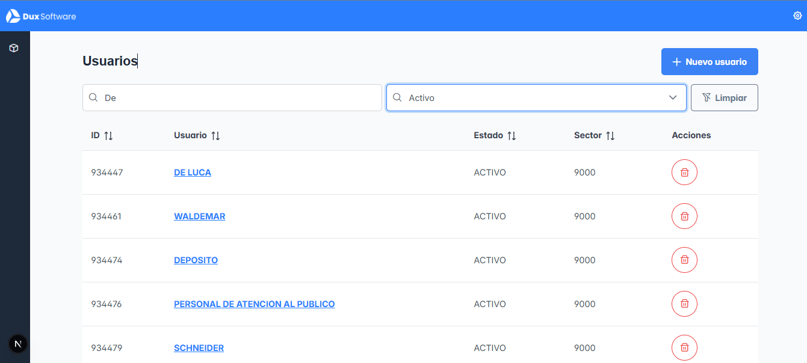
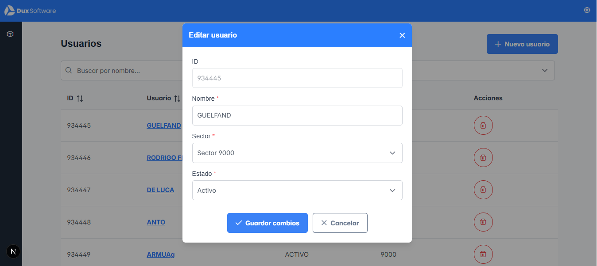

# Challenge Dux



## Instalación

1. Cloná el repositorio
```bash
git clone <https://github.com/Joapozzo/JoaquinPozzo-ChallengeDux.git>
cd JoaquinPozzo-ChallengeDux
```

2. Instalá las dependencias
```bash
npm install
# o
yarn install
# o
pnpm install
```

## Variables de entorno

Crea un archivo `.env.local` en la raíz del proyecto con las siguientes variables:

```env
NEXT_PUBLIC_API_URL=https://staging.duxsoftware.com.ar/api-test
NEXT_PUBLIC_SECTOR_ID=9000
```

**Variables necesarias:**
- `NEXT_PUBLIC_API_URL`: URL de la API
- `NEXT_PUBLIC_SECTOR_ID`: ID del sector

## Levantá el proyecto

### Desarrollo
```bash
npm run dev
```

Abre [http://localhost:3000](http://localhost:3000) en tu navegador.

## Arquitectura del proyecto

```
src/
├── actions/          # Server actions
├── app/              # Next.js App Router
├── components/       # Componentes organizados por Atomic Design
│   ├── atoms/        # Componentes básicos
│   ├── molecules/    # Combinaciones de átomos
│   ├── organisms/    # Componentes complejos
│   └── pages/        # Componentes de página
├── context/          # React Context providers
├── hooks/            # Custom hooks
├── lib/              # Utilidades y constantes
├── styles/           # Estilos globales y módulos CSS
└── types/            # Definiciones TypeScript
```

## Tecnologías y dependencias

- **Next.js 16**
- **React 19**
- **TypeScript**
- **PrimeReact**
- **PrimeFlex**
-- **TailwindCSS**
-- **Zod**

## Funcionalidades

- Listado de usuarios con paginación
- Creación de usuarios mediante modal reutilizable
- Edición de usuarios
- Eliminación de usuarios
- Búsqueda por nombre o apellido (coincidencia parcial)
- Filtro por estado (ACTIVO / INACTIVO)
- Paginado utilizando `_limit` y `_page`
- Manejo de loading con `Suspense` y `Lazy` 
- Validaciones de formulario con Zod
- Actualización automática de la tabla tras cada acción
- Filtros sincronizados con URL Params & estados locales
- Fetching en server components con `Server Actions`
---

## Decisiones técnicas

- Se utilizó **Next.js App Router** con componentes **Server y Client** para optimizar la carga inicial.
- Las llamadas a la API se realizan desde componentes **Server Side** siempre que es posible.
- Los formularios de **crear y editar** reutilizan el mismo componente.
- Se evita el prop drilling mediante manejo local de estado y responsabilidad única.
- Estructura de componentes basada en **Atomic Design**.
- Se respetan las convenciones de estilos de **PrimeReact + PrimeFlex**.
- Se agregó una columna Acciones para eliminar usuarios.
- Se instalo la dependencia Zod para facilitar el manejo de los errores en los formularios

## Preview


